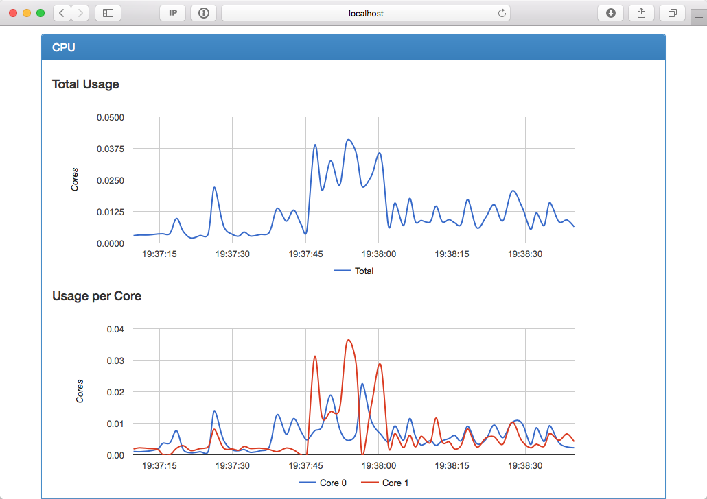
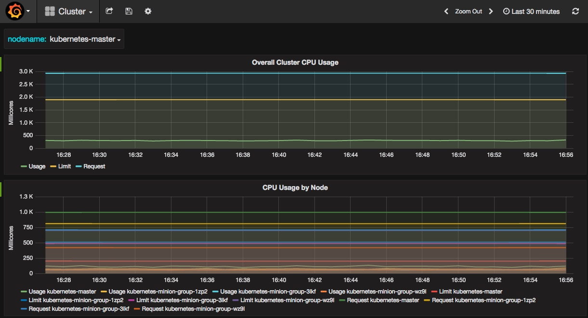

# Prometheus监控

## cAdvisor

[cAdvisor](https://github.com/google/cadvisor)是一个来自Google的容器监控工具，也是kubelet内置的容器资源收集工具。它会自动收集本机容器CPU、内存、网络和文件系统的资源占用情况。



## InfluxDB和Grafana

[InfluxDB](https://www.influxdata.com/time-series-platform/influxdb/)是一个开源分布式时序、事件和指标数据库；而[Grafana](http://grafana.org/)则是InfluxDB的dashboard，提供了强大的图表展示功能。



## Prometheus

[Prometheus](https://prometheus.io)是另外一个监控和时间序列数据库，并且还提供了告警的功能。他提供了强大的查询语言和HTTP接口，也支持将数据导出到Grafana中展示。


## Prometheus监控docker

使用[docker-compose.yml](docker-compose.yml)可以方便的启动一个cAdvisor、Prometheus和Grafana展示的服务。

## Prometheus监控kubernetes

使用[prometheus.yml](prometheus.yml)可以方便的启动一个Prometheus服务监控整个Kubernetes集群的状态：

```
kubectl create -f prometheus.yml
```
